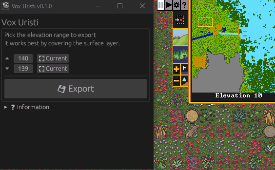

[<i class='fas fa-download'></i> Download Latest](){: .btn .btn--info}
[<i class='fas fa-external-link-alt'></i> View on Github](https://github.com/plule/vox-uristi){: .bnt}

## Introduction

Export your Dwarf Fortress map in a voxel format to create beautiful rendering
of your fortresses.

**Vox Uristi** uses [DFHack's
RemoteFortressReader](https://docs.dfhack.org/en/stable/docs/tools/RemoteFortressReader.html)
to read the fortress data and export it in the `.vox` format. The resulting file
can then be opened in a software such as MagicaVoxel to render it.



## Usage

⚠ Vox Uristi is in development. The exported map is lacking important features,
and could not work at all in some cases. Please report any issue you see. Save
your game before exporting, as certain bug could trigger a Dwarf Fortress crash
{: .notice--danger }

First, ensure you have [Dwarf
Fortress](https://store.steampowered.com/app/975370/Dwarf_Fortress/) with
[DFHack](https://store.steampowered.com/app/2346660/DFHack__Dwarf_Fortress_Modding_Engine/).
Vox Uristi is mostly tested with the latest Steam release, but could work with
previous versions too.

While in game in the save you wish to export, run Vox Uristi and select the
upper and lower bound to export. Only the zone between these two altitudes will
be included in the exported model. It works best by selecting the surface area
of your map.

Once exported, open the `.vox` file with [MagicaVoxel](https://ephtracy.github.io/).

⚠ The same website has a dedicated voxel viewer. At the moment, the exported
files are not correctly rendered by this viewer.
{: .notice--danger }

You can see the whole process on this mod spotlight made by Blind: [How-to Video](https://www.youtube.com/watch?v=CDqMuBZsNH0).

## Features/Roadmap

- ☑ Base building blocks (walls, floors, fortifications)
- ☑ Water, magma and grass
- ☑ Basic material colors
- ☑ Directional ramps
- ☑ Rough/Smooth floor representation
- ☑ Basic tree support, inaccurate but good enough
- ☑ Most construction items (doors, windows, bars, bridges, furnitures, workshops)
- ☑ Flows, waves and mist
- ☑ Seasonal plants
- ☑ Detailed materials (metallic, water, light emission)
- ☑ Building content (books on bookcases, items in workshops, ...)
- ☑ Spatters
- ☐ Item state (opened/closed)
- ☐ Rails
- ☐ Advanced export parameters (enable/disable/control amount of folliage,
  roughness voxels, building content...)

## Other Dwarf Fortress visualisation tools

Vox Uristi is only intended to make one-off renders of fortresses. Other tools
can be used for different kind of usage or render.

For real-time isometric rendering:
[stonesense](https://docs.dfhack.org/en/stable/docs/tools/stonesense.html).

For real-time 3D rendering: [Armok Vision](https://github.com/RosaryMala/armok-vision).

For one-off render of the world map: [VoxelFortress](https://github.com/RosaryMala/VoxelFortress/releases/tag/v1.0.0).
